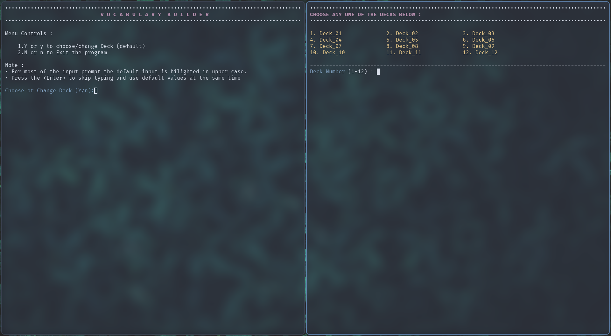
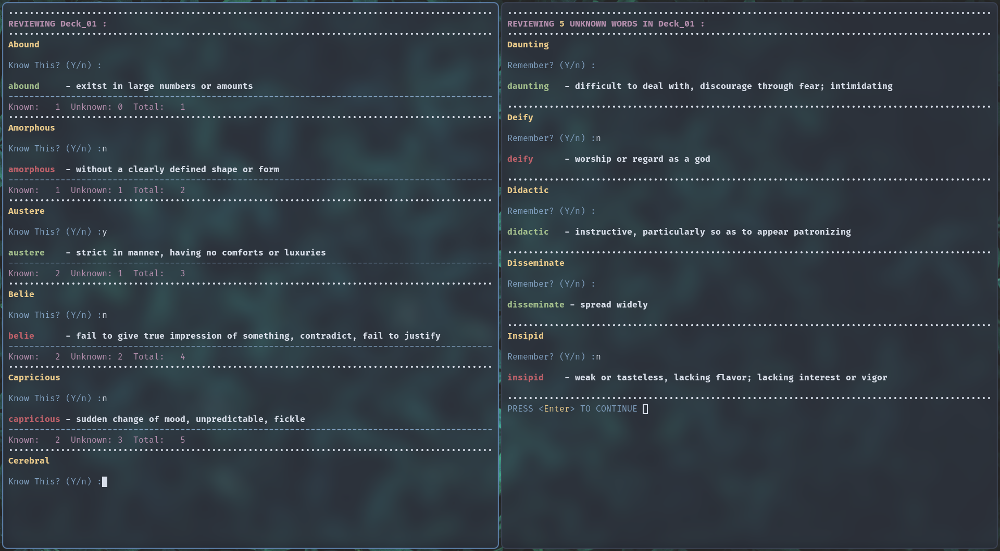

# Vocabulary Builder

:zap: A **Console / CLI** based vocabulary building application implemented using python, start [here](#Instructions)

:fire: A responsive web application built using **Vanilla Javascript**, you can check out [here](https://surajtc.github.io/Vocabulary-Builder/)

---

## Instructions/ Guide

### Getting Started

Clone this repository and run `main.py` as shown below

```bash
git clone https://github.com/SurajTC/Vocabulary-Builder.git; cd Vocabulary-Builder
```

```bash
python main.py
```

Note : This application only works with **Python 3.x.x**, and can be used right out of the box - no additional dependencies are required.

### How To Use

* Run `python main.py` in your preferred terminal emulator to get started.
* If everything works as expected, A menu is displayed on the console (as shown in the screenshot), just follow the instructions on the prompt which is almost self-explanatory.
* View [screenshots](#Screenshots)

Cheers! Happy Learning :tada:

## Todo

- [ ] Menu Navigation
- [ ] Quiz Interface
- [X] Add More Decks

## Attribution

* The Vocabulary List used in this project is sourced from [Greg Mat's Vocabulary List (900 words)](https://gregmatapi.s3.amazonaws.com/media/misc/files/gregmat_wordlist.pdf).

Thank you Greg Mat 🙂
, For more information checkout [gregmat.com](https://www.gregmat.com/).

## Screenshots (CLI)

* **Main Menu (left), Deck Selection (right)**



* **Reviewing Vocabulary Words**


